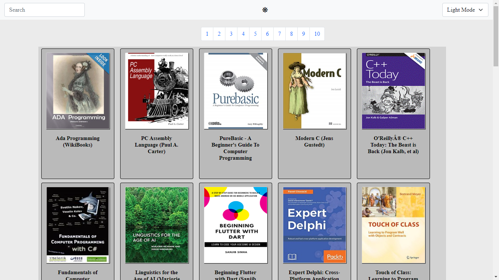
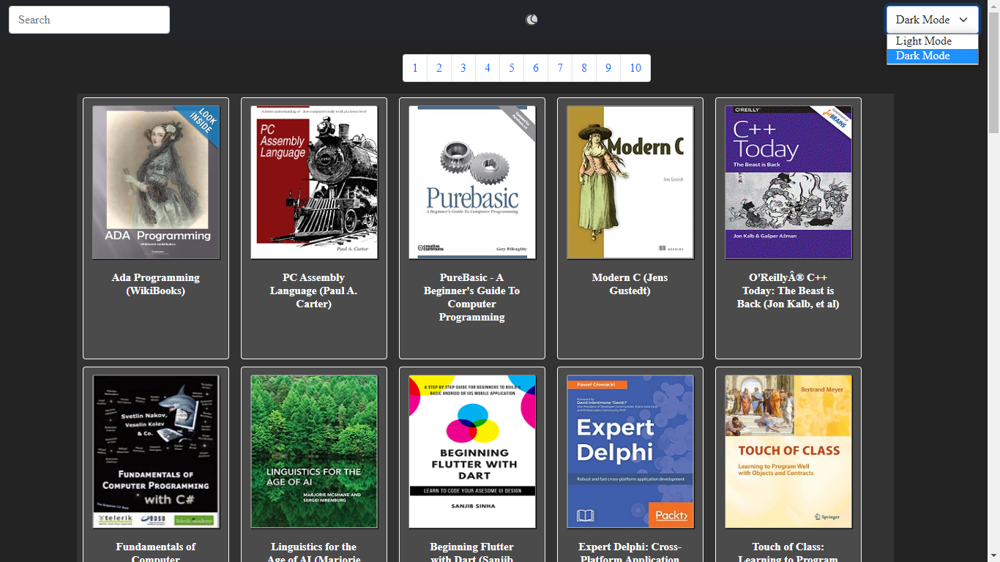
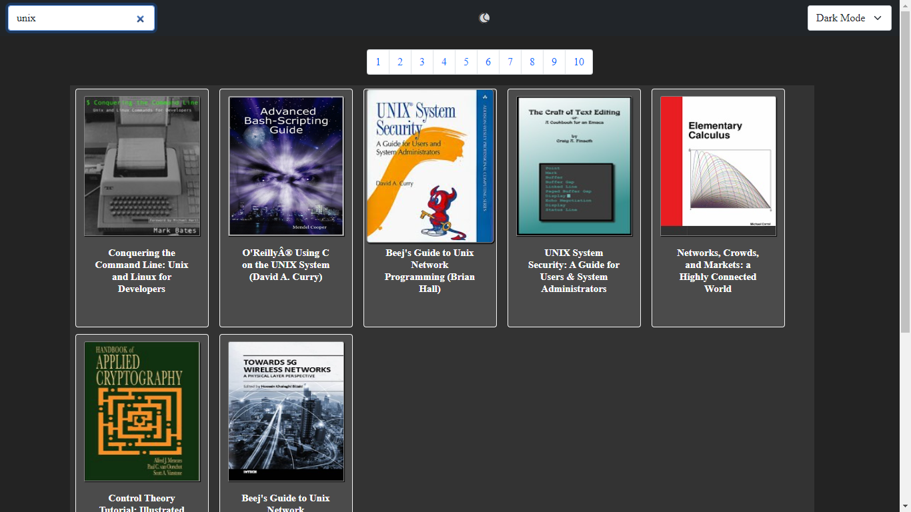
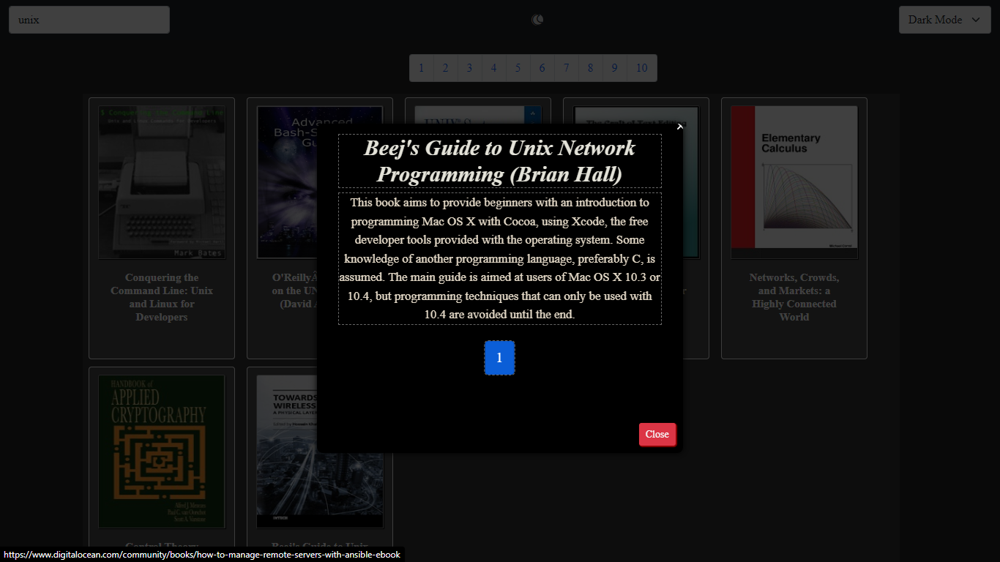

# web-scrap-freecomputerbook
>Página gerada com web scrap usando Python 3.7.

# O que o projeto faz ?
>O projeto é um site que foi gerado dinamicamente com os dados que o script em python conseguiu buscar.

# Por que o projeto é útil ?
>Foi útil para aprender a manipular elementos da web com python e também manter um acervo de livros bem legais.

# Como os usuários podem começar a usar o projeto ?
>É só clonar o repositório e abrir o index.html.

# Observações
>Esse projeto não foi finalizado, por isso pode ter algumas falhas de estilo.
>Acabei gerando um html bem extenso, poderia ter feito de uma outra maneira mais prática.
>Faltou algumas informações a respeito dos livros.

# Considerações Finais
>Pretendo fazer finos ajustes mas não refazer o projeto, pois já perdi o script em python.

# Imagens
>
>
>
>
